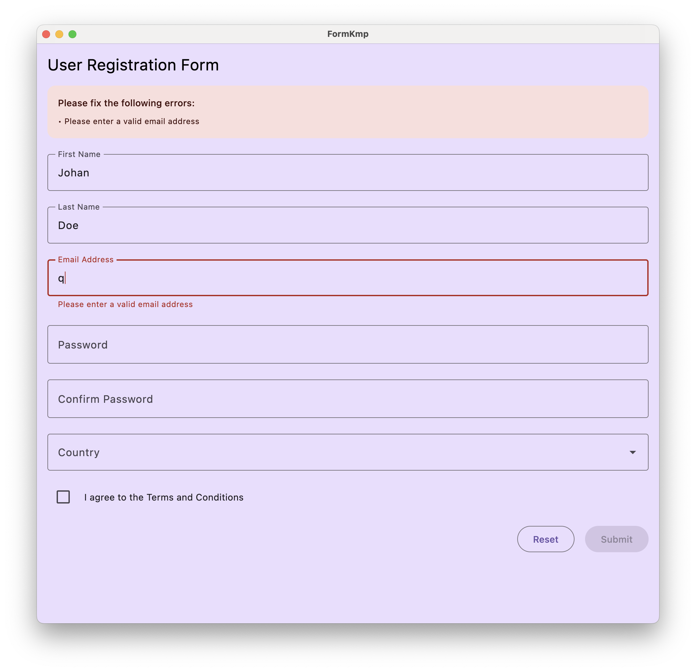
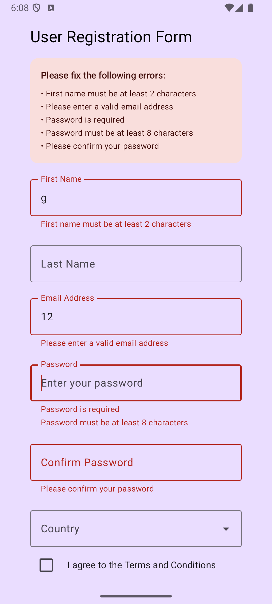

# Form KMP Library

A professional, cross-platform form library for Jetpack Compose that works seamlessly across Android, iOS, Desktop, and Web platforms.

## Screenshots

 

## Platform Support

| Platform    | Status             |
| ----------- | ------------------ |
| **Android** | ✅ Full Support    |
| **iOS**     | Coming Soon        |
| **Desktop** | ✅ -- Full Support |
| **Web**     | Coming Soon        |

## 📦 Installation

Add to your `build.gradle.kts`:

```kotlin
dependencies {
    implementation("com.composeform:compose-form:0.0.1-rc.0")
}
```

## ✨ Features

- **Cross-Platform Compatibility:** Write your form logic once and run it on Android, iOS, Desktop, and Web.
- **Built for Jetpack Compose:** Leverages the power and flexibility of Jetpack Compose for a modern UI experience.
- **Easy to Use:** A simple and intuitive API for creating and managing forms.
- **Validation:** Built-in support for input validation with customizable rules.
- **Extensible:** Easily extend and customize the library to fit your specific needs.

## 🚀 Usage

Here's a basic example of how to create a simple form:
